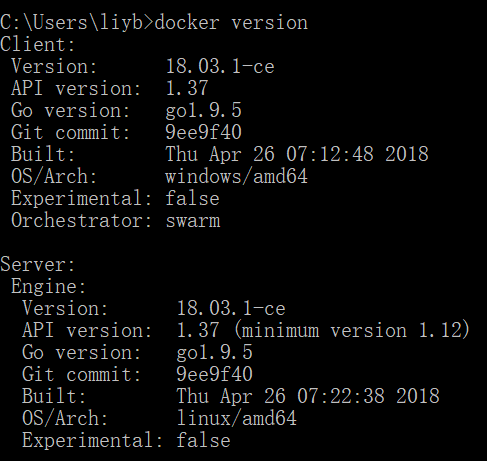
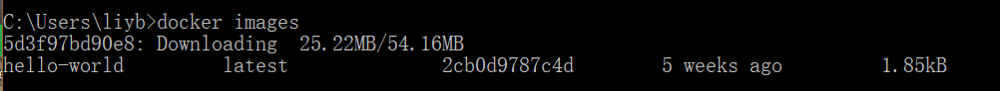
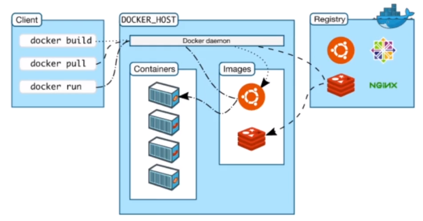
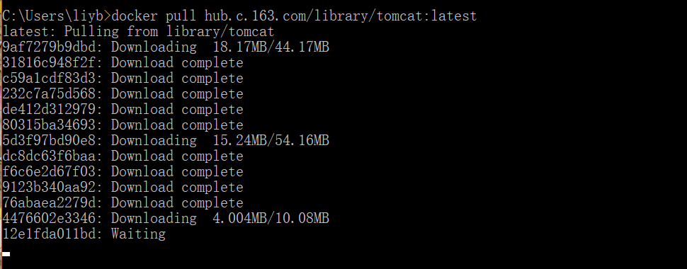
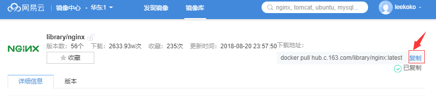

# Docker   

### 获取镜像

Z：下载Docker，默认安装。之后打开Docker Quickstart，它会从git上下载文件下来。   

M：怎么看Docker是否已经安装成功？

Z：命令``docker version``    



M：docker怎么查看镜像列表？

Z：``docker images``   

  

M：那怎么下载镜像呢？

Z：例如``docker pull hello-world``   

M：docker的项目是从哪里拿到的呢？

Z：docker仓库，通过国内网易镜像中心的 https://c.163yun.com/hub#/m/home/ 可以搜索到想要的镜像。     

M：镜像列表的镜像要怎么删除呢？

Z：首先使用``docker rm {container的id}``删除相关的container，然后删除镜像``docker rmi {image的id}``   

M：怎么获取到container的地址呢？

Z：使用``docker ps -a``即可查看。

### 运行镜像  

M：怎么运行镜像列表中的镜像呢？

Z：例如命令``docker run hello-world``   

M：docker run执行的时候发生了什么？

Z：如下图

  

M：怎么通过docker运行nginx呢？

Z：拉取镜像之后，运行docker

1. 拉取镜像``docker pull hub.c.163.com/library/nginx:latest``     

     

   这个地址来自于网易云的镜像库   

   

2. 运行docker：``docker run -d hub.c.163.com/library/nginx``   （添加-d参数表示在后台运行）  

M：为什么运行之后没有效果呢？

Z：通过``docker ps``可以查看进程。

Z：如果没添加-d，为前台运行的，使用Ctrl + C就能把nginx关闭。

Z：指定name启动``docker run -itd --name testName -d -P hub.c.163.com/library/tomcat``  

### 查看镜像  

M：怎么查看镜像内部的内容呢？

Z：进入一个docker的命令：``docker exec -it f4 bash``，其中f4表示的是容器的标识Code，只要输入能区别的前部分即可。输入之后即可进入一个类似虚拟机的环境。   

M：要想看nginx的位置，怎么做？

Z：用linux的命令即可：``which nginx``   

M：那要怎么退出docker呢？

Z：使用命令``exit``即可。   

M：怎么关闭运行的容器呢？   

Z：``docker stop f``命令即可，f指的是容器的编号开头区别字母       

M：怎么重启docker容器呢?

Z：``docker restart 12f``，12f指的是容器的编号开头区别字母   

### Docker网络    

M：怎么运行指定的对象到指定的端口上呢？

Z：例如``docker run -d -p 8080:80 hub.c.163.com/library/nginx``   

M：linux中怎么查看端口的状态呢？

Z：``netstat -na|grep 8080``即可   

M：那我如果不知道用哪个端口，怎么让它随机选端口呢？

Z：使用``docker run -d -P hub.c.163.com/library/nginx``命令即可，这个时候想知道端口是多少需要用``docker ps``查看进程。   

### 自定义镜像   

M：首先要做什么？

Z：编写Dockerfile，然后build构建镜像   

1. 使用tomcat镜像作为基础镜像，去把tomcat镜像下载下来。

2. 编写Dockerfile  ``vi Dockerfile``  

   ```properties
   # 基础镜像
   from hub.c.163.com/library/tomcat
   
   MAINTAINER leekoko xxx@qq.com
   
   COPY jpress.war /usr/local/tomcat/webapps
   ```

3. 到Dockerfile所在目录下运行 ``docker build -t dockName:latest .``  构建项目，使用 ``docker images`` 即可看到已创建的镜像。

M：win10下的Dockerfile怎么创建？

Z：直接右键新建txt文件，去掉txt后缀即可

## 常用命令  

M：docker的run没有留下进程？

Z：可能是命令没有卡住，构建dockerfile，添加``CMD tail -f /dev/null ``,即可以将容器启动卡住。