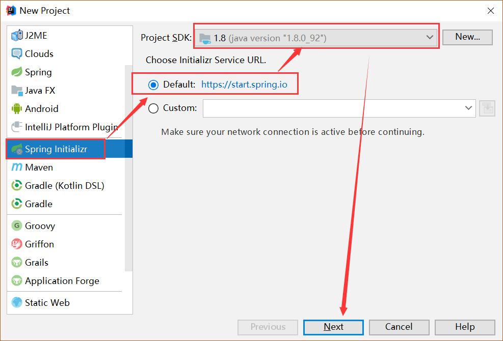
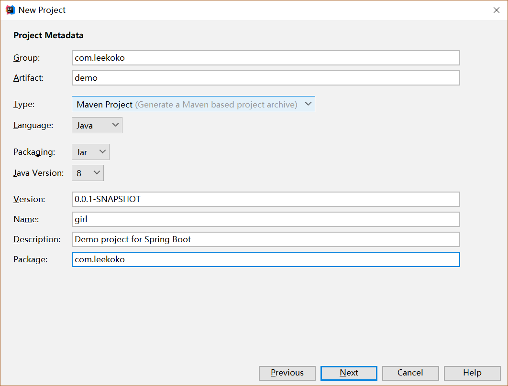
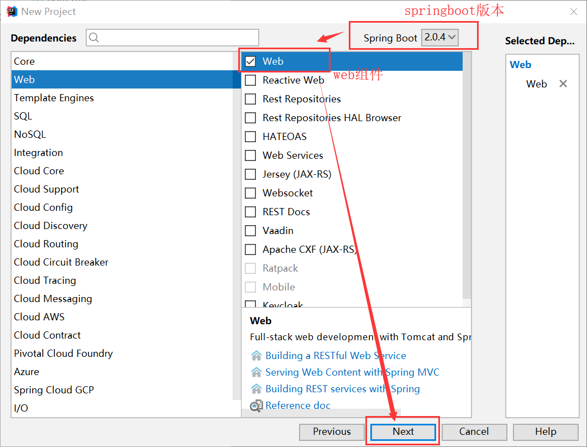
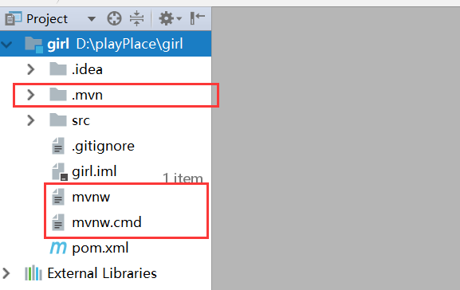
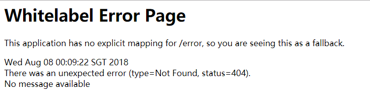

# SpringBoot    

D：SpringBoot为SpringMVC升级版。简化配置，很可能成为下一代的框架。   

## 1.新建项目

Z：使用IntelliJ IDEA  ， 其破解地址为：``http://idea.lanyus.com/``    或者  ``https://jetlicense.nss.im/``   

M：怎么创建springBoot项目呢？

Z： 创建步骤复杂一点点

1. New Project -- Spring Initializr -- 选择web

     

2. 确定文件路径		  

3. 选择版本，组件

     

4. 选择路径进行保存。删除没用的文件

     

## 2.启动SpringBoot项目

Z：运行自动生成的XXApplication类，其必须带有``@SpringBootApplication``注解，右键Run XX即可启动项目。   

```java
@SpringBootApplication
public class HellospringbootApplication {
	public static void main(String[] args) {
		SpringApplication.run(HellospringbootApplication.class, args);
	}
}
```

M：为什么我没有Run XX按钮？

Z：idea在初次启动的时候需要加载许多东西，建议maven使用阿里云的仓库，加载完之后才会出现Run XX按钮。

Z：当出现此页面的时候，说明springBoot启动成功  

   

M：怎么编写一个Controller文件呢？

Z：添加类似Spring的注解，启动即可访问。(也可以先编译，通过命令启动)

```java
@RestController
public class HelloController {
    @RequestMapping(value = "/hello",method = RequestMethod.GET)
    public String say(){
        return "Hello spring Boot!";
    }
}
```

M：怎么进行代码补全呢？

Z：由于代码补全快捷键冲突了，所以需要进行修改。

## 3.配置文件使用

Z：新建的项目中，application.properties就是新建项目默认的配置文件。这里可以对访问端口和访问路径进行配置。

```properties
server.port=8081
server.context-path=/girl
```

相似的，application.yml也是默认配置文件，其使用分组的格式，:之后必须加**空格**，子内容前面为**tab键**   

```properties
server:
	port: 8081
	context-path: /girl
```

M：yml可以配置java代码中注入的值吗？

Z：也行，直接写  ``键:值``，用``@Value("${键}")``的方式即可注入。  

M：那可以用@Value把配置文件内容注入到java中，那要怎么注入到xml中呢?

Z：直接用${}就可以引用了

```properties
server:
	port: 8081
age: 18
size: B
content: "size: ${size}，age: ${age}"
```

M：当配置文件需要频繁变换，怎么灵活切换呢？

Z：将其写成两个配置文件，而主配置文件只要选好要哪一个配置文件即可。   

1. 新建两个配置文件 application-dev.yml   &  application-prod.yml

2. 在application.yml中指定调用哪一个配置文件：

   ```properties
   spring:
   	profiles:
   		active:dev
   ```

   调用dev后缀的配置文件。

## 4.注解的使用

### 1.@Component  & @ConfigurationProperties  

M：一个个属性注入太麻烦了，有没有注入对象的方法？

Z：修改配置文件为组的形式，编写pojo对象映射，再将pojo对象注入

```properties
server:
	port: 8081
girl:
	age: 18
	size: B
```

pojo对象，需要``@Component ``定义Spring管理Bean，``@ConfigurationProperties``指定前缀内容。

``@Component``注解相当于:@Service,@Controller,@Repository，并下面类纳入进spring容器中管理。这样才能被下一层@Autowired注入该对象。 

```java
@Component
@ConfigurationProperties(prefix = "girl")
public class GirlProperties {

    private String size;

    private Integer age;

    public String getSize() {
        return size;
    }

    public void setSize(String size) {
        this.size = size;
    }
    ...
}
```

运行``@SpringBootApplication``,即可访问Controller的内容   

```java
@RestController
public class HelloController {

    @Autowired
    private GirlProperties girlProperties;

    @RequestMapping(value = "/hello",method = RequestMethod.GET)
    public String say(){
        return girlProperties.getSize();
    }
}
```

### 2.@RestController   

Z：@RestController  =  @ResponseBody + @Controller  

### 3.@RequestMapping

1. @RequestMapping可以指定多个value： ``@RequestMapping(value={"/say","/hi"})`` 。   

2. @RequestMapping的Get请求获取参数的方式：

   1. 方式一PathVariable：访问地址中间参数传输：

      ```java
          @RequestMapping(value="/{id}/say",method = RequestMethod.GET)
          public String say(@PathVariable("id") Integer id){
              return "Hello Spring Boot:"+id;
          }
      ```

      url访问地址可以将id中间位置：``http://localhost:8080/hello/233333/say``   

   2. 方式二RequestParam：访问地址后面传值：  

      ```java  
          @RequestMapping(value="/say",method = RequestMethod.GET)
          public String say(@RequestParam("id") Integer id){
              return "Hello Spring Boot:"+id;
          }
      ```

      - url访问方式：``http://localhost:8080/hello/say?id=110``     
      - 添加默认值：``(@RequestParam(value = "id", required = false, defaultValue = "0") Integer id)``  ,如何不传id，它就会默认为0。  

   3. ``@RequestMapping(value="/say",method = RequestMethod.GET)``也可以写成``GetMapping(value="/say")``的方式。   

### 4.@Transactional  

M：当我一个Service的方法里有两条sql插入操作，怎么保证其同时执行成功或者同时执行失败？

Z：在方法上面添加``@Transactional``注解，即说明其为同个事务。

```java
    @Transactional
    public void insertTwo(){
        Girl girlA = new Girl();
        girlA.setSize("A");
        girlA.setAge(10);
        girlRepository.save(girlA);

        Girl girlB = new Girl();
        girlB.setSize("BBBBB");
        girlB.setAge(20);
        girlRepository.save(girlB);
    }
```

M：为什么我添加之后，还是有一个成功，一个失败呢？

Z：只有在innodb引擎下事务才能工作。所以需要在数据库中执行``ALTER TABLE girl ENGINE=innodb``命令。

## 5.数据库操作   

### 1.创建表   

Z：要操作数据库，首先添加组件

1. pom.xml添加组件

   ```xml
   		<dependency>
   			<groupId>org.springframework.boot</groupId>
   			<artifactId>spring-boot-starter-data-jpa</artifactId>
   		</dependency>

   		<dependency>
   			<groupId>mysql</groupId>
   			<artifactId>mysql-connector-java</artifactId>
   		</dependency>
   ```

2. application.yml配置数据库连接：

   ```properties
   spring:
     datasource:
       driver-class-name: com.mysql.jdbc.Driver
       url: jdbc:mysql://127.0.0.1:3306/test
       username: root
       password: 123456
     jpa:
       hibernate:
         ddl-auto: create
       show-sql: true
   ```

   - ``ddl-auto: create``:每次都重新创建数据库，数据不保存，要保存得用``update``。   
   - ``show-sql: true``:打印sql语句。   

M：为什么启动报错？

Z：需要在mysql中创建对应的数据库。

D：怎么利用SpringBoot的jpa进行自动建表呢？   

Z：配置完上方的jpa之后，编写pojo对象，添加``@Entity``注解，标注id``@Id``，自增长``@GeneratedValue``，运行之后数据库就会自动生成对应表。``ddl-auto: create``配置将决定表是创建create还是更新update      

```java
@Entity
public class Girl {

    @Id
    @GeneratedValue
    private Integer id;

    private String size;

    private Integer age;

    public Integer getId() {
        return id;
    }
    ...
}
```

### 2.JPA实现增删改查   

M：怎么实现查询所有呢？

Z：新建接口，继承``JpaRepository<Girl, Integer>``，注入接口，直接调用``JpaRepository``中的CRUD方法即可    

1. 新建接口

   ```java
   public interface GirlRepository extends JpaRepository<Girl, Integer> {

   }
   ```

2. 调用CRUD方法   

   ```java
       /**
        * 查询所有
        * @return
        */
       @GetMapping(value = "/girls")
       public List<Girl> girlList() {
           return girlRepository.findAll();
       }

       /**
        * 根据id查询
        * @param id
        * @return
        */
       @GetMapping(value = "/girlById/{id}")
       public Girl girlFindOne(@PathVariable("id") Integer id) {
           Optional<Girl> temp = girlRepository.findById(id);
           //从返回值中获取值
           return temp.get();
       }

       /**
        * 添加内容
        * @param age
        */
       @PostMapping(value = "/girlAdd")
       public Girl girlAdd(@RequestParam("size") String size, @RequestParam("age") Integer age) {
           Girl girl = new Girl();
           girl.setAge(age);
           girl.setSize(size);
           return girlRepository.save(girl);
       }

       /**
        * 更新
        */
       @PutMapping(value = "/moGirlById/{id}")
       public Girl girlUpdate(@PathVariable("id") Integer id, @RequestParam("age") Integer age,@RequestParam("size") String size) {
           Girl girl = new Girl();
           girl.setId(id);
           girl.setAge(age);
           girl.setSize(size);
           return girlRepository.save(girl);
       }

       /**
        * 删除
        */
       @DeleteMapping(value = "/delGirls/{id}")
       public void girlDelete(@PathVariable("id") Integer id) {
           Girl girl = new Girl();
           girl.setId(id);
           girlRepository.delete(girl);
       }
   ```

M：如果某些方法在JpaRepository中不存在呢？

Z：可以自己使用扩展方法，写在接口中，调用即可。但是要求方法名要规范

```java
public interface GirlRepository extends JpaRepository<Girl, Integer> {
    //通过年龄查询
    public List<Girl> findByAge(Integer age);
}
```

```java
    /**
     * 通过年龄查询
     */
    @GetMapping(value = "/girlByAge/{age}")
    public List<Girl> getListByAge(@PathVariable("age") Integer age) {
        return girlRepository.findByAge(age);
    }
```

[查看源码](../SourceCode/girl)      

