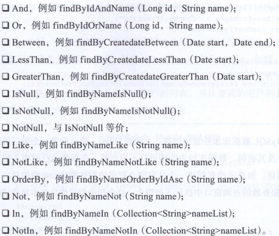

# SpringBoot数据库   

Z：SpringBoot使用JPA实现对数据库的操作，JPA就是将Java的普通对象关系映射持久化到数据库中。  

### 1.JPA环境  

M：想要使用JPA需要什么环境呢？

Z：如下步骤：

1. 引入maven

   ```xml
   <dependency>
       <groupId>org.springframework.boot</groupId>
       <artifactId>spring-boot-starter-data-jpa</artifactId>
   </dependency>
   
   <dependency>
       <groupId>mysql</groupId>
       <artifactId>mysql-connector-java</artifactId>
   </dependency>
   ```

2. application.yml配置数据库连接

   ```yaml
   spring:
     datasource:
       driver-class-name: com.mysql.jdbc.Driver
       url: jdbc:mysql://127.0.0.1:3306/test
       username: root
       password: 123456
     jpa:
       hibernate:
         ddl-auto: create
       show-sql: true
   ```

   - ``ddl-auto: create``:每次都重新创建数据库，数据不保存，要保存得用``update``。   
   - ``show-sql: true``:打印sql语句。   
   - 创建对应的数据库

### 2.Pojo编写

Z：JPA对POJO要求添加对应的注解，Demo如下

```java
@Entity
@Table(name = "deparment")
public class Deparment {
    @Id
    @GeneratedValue(strategy = GenerationType.IDENTITY)
    private Long id;
    
    private String name;
    
    @DateTimeFormat(pattern = "yyyy-MM-dd HH:mm:ss")
    private Date createDate;
    
    @ManyToOne
    @JoinColumn
    @JsonBackReference
    private Deparment deparment;

    @ManyToMany(cascade = {},fetch = FetchType.EAGER)
    @JoinTable(name = "user_role",
    	joinColumns = {@JoinColumn(name = "user_id")},
    	inverseJoinColumns = {@JoinColumn(name = "roles_id")})
    private List<Role> roles;
    
	...
}
```

- @Entity：注明是实体类
- @Table(name = "deparment") ：  生成数据表名
- @Id ：指定唯一标识
- @GeneratedValue(strategy = GenerationType.IDENTITY)：设置为自动生成，生成策略为自增长。``GenerationType.Auto``为自动策略选择，假如数据库是Oracle，则选择Sequence。   
- @DateTimeFormat(pattern = "yyyy-MM-dd HH:mm:ss")：日期类型进行格式化
- @ManyToOne：与该对象是多对一关系

- @JsonBackReference：防止对象递归访问

M：JPA修改字段属性之后，怎么更新到数据库表中？

### 3.继承接口

Z：要使用APJ，需要1. 继承接口 2. 传实体类过去 3. 添加@Repository注解

```java
@Repository
public interface UserRepository extends JpaRepository<User,Long>{
}
```

### 4.JPA实现增删改查   

M：Controller使用接口的DEMO？

```java
    /**
     * 查询所有
     * @return
     */
    @GetMapping(value = "/girls")
    public List<Girl> girlList() {
        return girlRepository.findAll();
    }

    /**
     * 根据id查询
     * @param id
     * @return
     */
    @GetMapping(value = "/girlById/{id}")
    public Girl girlFindOne(@PathVariable("id") Integer id) {
        Optional<Girl> temp = girlRepository.findById(id);
        //从返回值中获取值
        return temp.get();
    }

    /**
     * 添加内容
     * @param age
     */
    @PostMapping(value = "/girlAdd")
    public Girl girlAdd(@RequestParam("size") String size, @RequestParam("age") Integer age) {
        Girl girl = new Girl();
        girl.setAge(age);
        girl.setSize(size);
        return girlRepository.save(girl);
    }

    /**
     * 更新
     */
    @PutMapping(value = "/moGirlById/{id}")
    public Girl girlUpdate(@PathVariable("id") Integer id, @RequestParam("age") Integer age,@RequestParam("size") String size) {
        Girl girl = new Girl();
        girl.setId(id);
        girl.setAge(age);
        girl.setSize(size);
        return girlRepository.save(girl);
    }

    /**
     * 删除
     */
    @DeleteMapping(value = "/delGirls/{id}")
    public void girlDelete(@PathVariable("id") Integer id) {
        Girl girl = new Girl();
        girl.setId(id);
        girlRepository.delete(girl);
    }
```

M：如果某些方法在JpaRepository中不存在呢？

Z：可以自己使用扩展方法，写在接口中，调用即可。但是要求方法名要规范

```java
public interface GirlRepository extends JpaRepository<Girl, Integer> {
    //通过年龄查询
    public List<Girl> findByAge(Integer age);
}
```

规范为findBy、readBy、getBy做为前缀，拼接属性（首字母大写），Demo如下：  

  

[查看源码](../SourceCode/girl)      

### 5.分页查询

M：怎么实现分页查询呢？

Z：Demo如下

```java
    @RequestMapping(value="/listPage")
    public String listPage(){
        //分页查询	page，size，排序
        Pageable pageable = new PageRequest(0,10,new Sort(Sort.Direction.ASC,"id")); 
        Page<User> page = userRepository.findAll(pageable);
        String result = "";
        for (User user:page.getContent()){
            result = user.getName()+":"+user.getDeparment().getName()+":"+user.getRoles().get(0).getName();
        }
        return result;
    }
```


